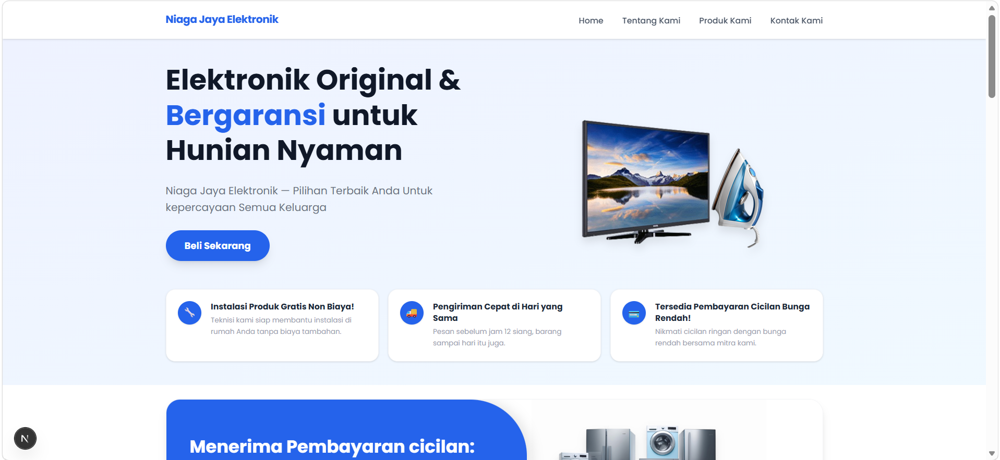
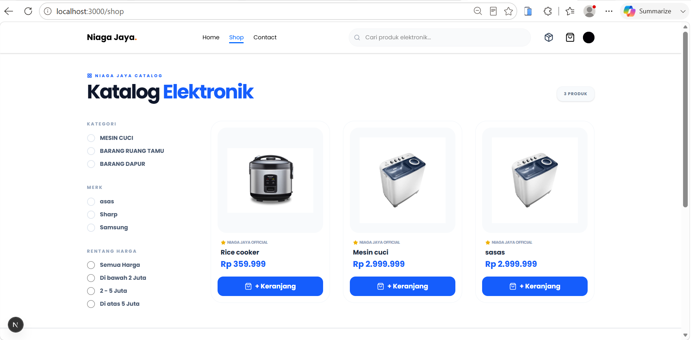
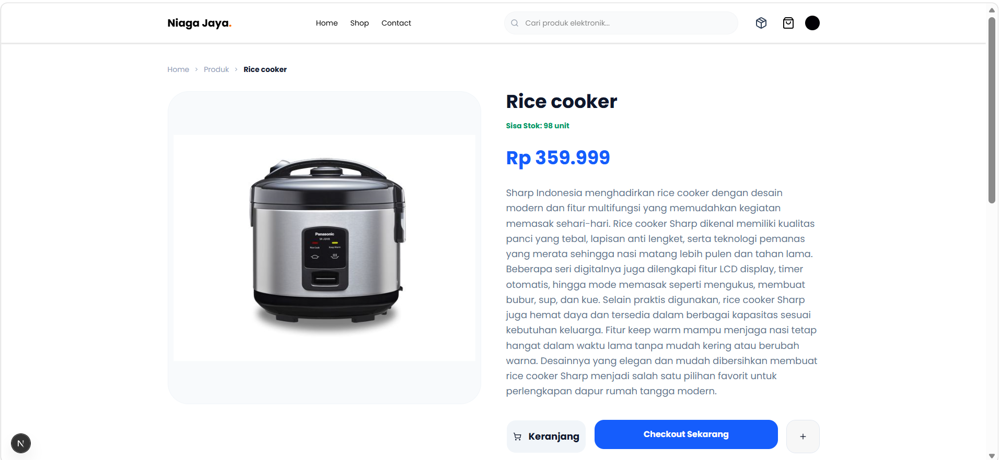
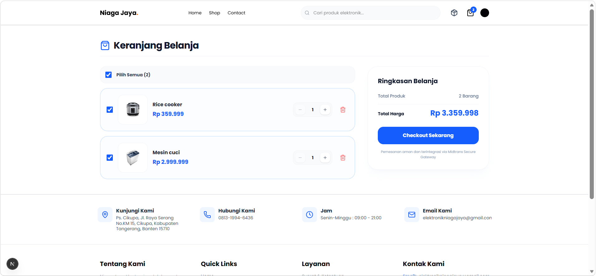
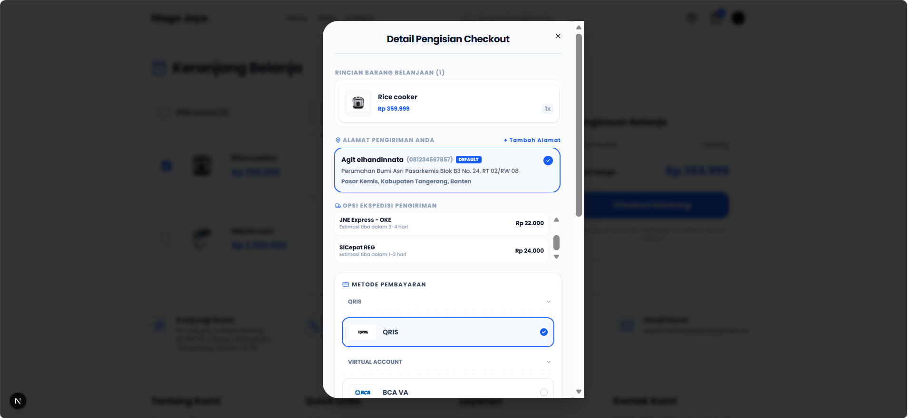
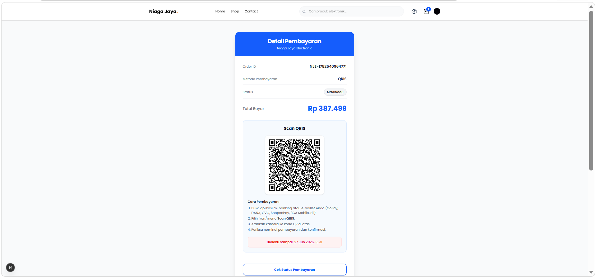
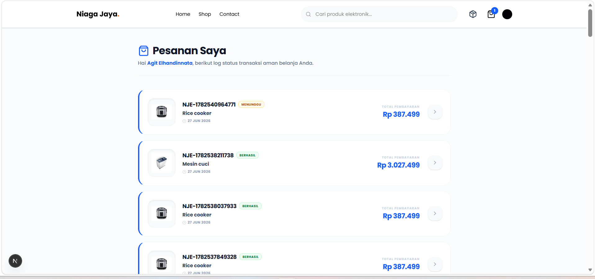
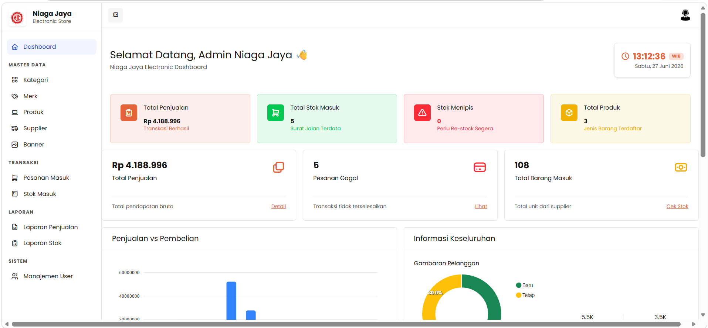
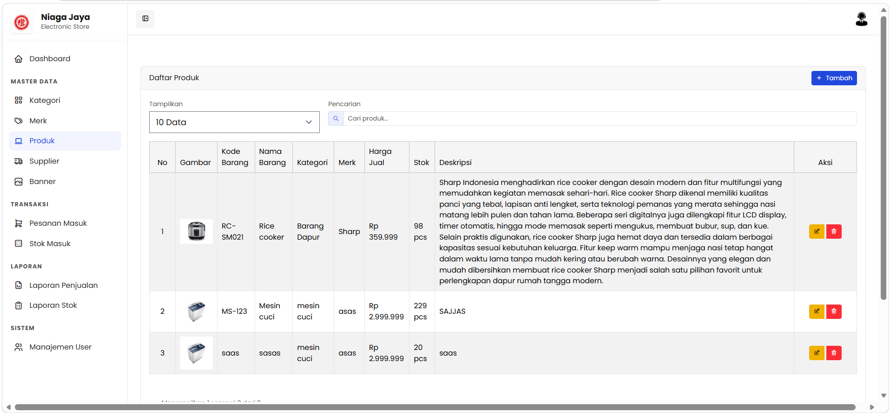
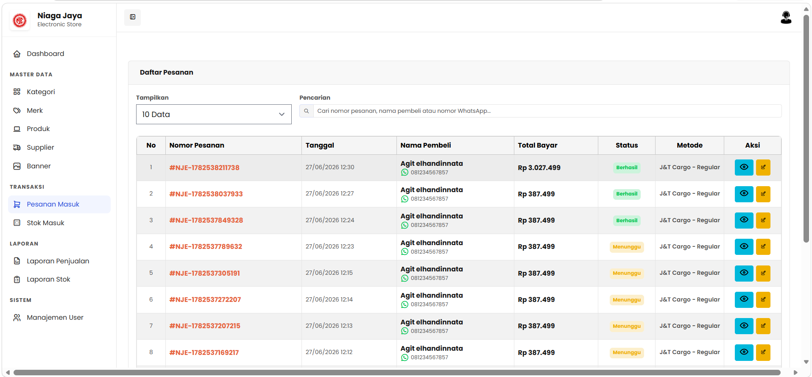

# 🛒 Niaga Jaya Electronic

<p align="center">
  
</p>

<p align="center">
  <b>Electronic Store E-Commerce System</b>
</p>

<p align="center">


</p>

---

# 📖 About Project

Niaga Jaya Electronic merupakan aplikasi **E-Commerce Penjualan Elektronik** yang dikembangkan untuk membantu proses penjualan produk elektronik secara online.

Project ini memiliki fitur manajemen produk, checkout, pembayaran online menggunakan Midtrans, manajemen pesanan, dashboard admin, serta landing page perusahaan.

---

# 📦 Repository Structure

Repository ini terdiri dari **3 project**.

| Folder | Description |
|---------|-------------|
| `niaga-jaya-admin` | Laravel Backend + Livewire Admin Dashboard |
| `niaga-jaya-electronic-ecommerce` | Next.js 16 E-Commerce Frontend |
| `niaga-jaya-company-profile` | Next.js 16 Company Profile Landing Page |

---

# 👥 User Roles

## 👤 User

- Login / Register (Clerk)
- Browse Products
- Search Products
- Product Detail
- Shopping Cart
- Checkout
- Midtrans Payment
- Order History
- Payment Tracking
- Product Review

---

## 👨‍💼 Admin

- Dashboard
- Manage Product
- Manage Brand
- Manage Category
- Manage Banner
- Manage Orders
- Shipping Management
- Update Tracking Number
- Product Review
- Export PDF Report

---

# 💳 Payment Method

Project ini menggunakan **Midtrans Core API**

Metode pembayaran yang tersedia

- QRIS
- BCA Virtual Account
- BNI Virtual Account
- BRI Virtual Account
- CIMB Virtual Account
- Permata Virtual Account

---

# 🚀 Technology Stack

## Backend

- Laravel 12
- PHP 8.4
- Livewire 4

## Frontend

- Next.js 16
- React
- Tailwind CSS
- Clerk Authentication

## Database

- MySQL
- PostgreSQL (Supabase)

## Payment

- Midtrans Core API

---

# ⚙️ Installation

## Requirements

- PHP 8.2+
- Composer
- Node.js 20+
- Laragon / XAMPP
- MySQL (phpMyAdmin) **or** Supabase PostgreSQL

---

## 1. Clone Repository

```bash
git clone https://github.com/AgitElhandinnata/niaga-jaya-electronic.git
```

---

## 2. Backend Installation

```bash
cd niaga-jaya-admin

composer install

cp .env.example .env

php artisan key:generate
```

---

# 🗄️ Database Configuration

Project ini mendukung **2 jenis database**.

---

## Option 1 — MySQL (Recommended for Local Development)

Buat database baru

```
niaga-jaya-electronic
```

Konfigurasi `.env`

```env
DB_CONNECTION=mysql
DB_HOST=127.0.0.1
DB_PORT=3306
DB_DATABASE=niaga-jaya-electronic
DB_USERNAME=root
DB_PASSWORD=
```

> Jika menggunakan Laragon, sesuaikan `DB_PORT` (3306 / 3307 / 3308).

Kemudian jalankan

```bash
php artisan migrate

php artisan storage:link

php artisan serve
```

---

## Option 2 — Supabase PostgreSQL

Konfigurasi `.env`

```env
DB_CONNECTION=pgsql
DB_HOST=YOUR_SUPABASE_HOST
DB_PORT=6543
DB_DATABASE=postgres
DB_USERNAME=YOUR_USERNAME
DB_PASSWORD=YOUR_PASSWORD
```

Kemudian jalankan

```bash
php artisan migrate

php artisan storage:link

php artisan serve
```

---

# 🌐 Frontend Installation

Masuk ke folder

```bash
cd niaga-jaya-electronic-ecommerce

npm install

npm run dev
```

Frontend

```
http://localhost:3000
```

---

# 🏢 Company Profile

Masuk ke folder

```bash
cd niaga-jaya-company-profile

npm install

npm run dev
```

---

# 🔑 Environment Variables

## Midtrans

```env
MIDTRANS_SERVER_KEY=

MIDTRANS_CLIENT_KEY=

MIDTRANS_IS_PRODUCTION=false
```

---

## Clerk

```env
NEXT_PUBLIC_CLERK_PUBLISHABLE_KEY=

CLERK_SECRET_KEY=
```

---

# 📸 Screenshots

## Landing Page

<p align="center">

</p>

---

## Product Page

<p align="center">

</p>

---

## Product Detail

<p align="center">

</p>

---

## Shopping Cart

<p align="center">

</p>

---

## Checkout

<p align="center">

</p>

---

## Payment

<p align="center">

</p>

---

## Order History

<p align="center">

</p>

---

## Admin Dashboard

<p align="center">

</p>

---

## Product Management

<p align="center">

</p>

---

## Order Management

<p align="center">

</p>

---

# ✨ Features

- Authentication with Clerk
- Product Management
- Category Management
- Brand Management
- Shopping Cart
- Checkout
- Midtrans Integration
- QRIS Payment
- Virtual Account Payment
- Shipping Management
- Product Review
- PDF Export
- Responsive Design

---

# 📄 License

This project was developed for educational purposes and portfolio showcase.

© 2026 Agit Elhandinnata
